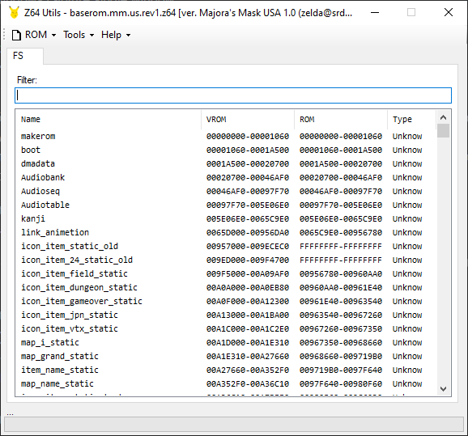
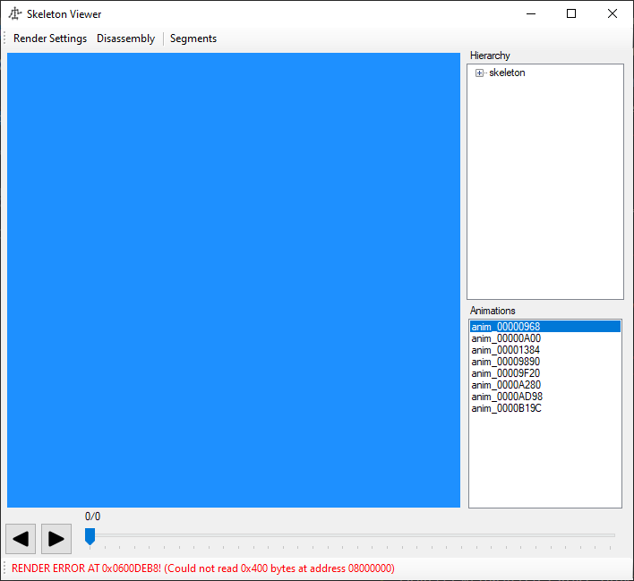
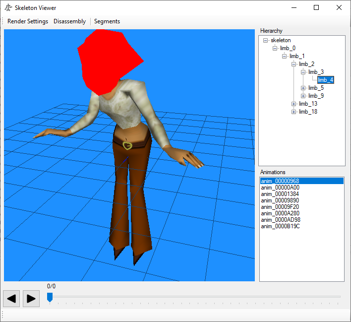
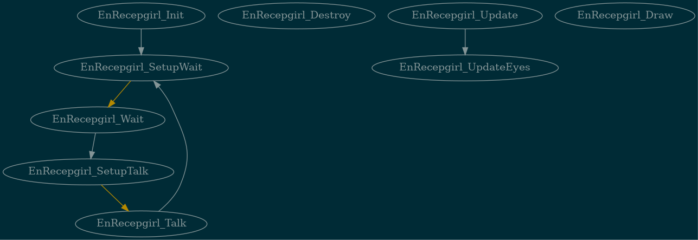

# Documenting

- Up: [Contents](contents.md)
- Previous: [Data](data.md)

Decompilation is only the first step: since the point of this project is to understand the game better than ever before, the code needs documentation. In this document, we will go through the basic stuff that it's good to do for any actor: we will not try to understand every single thing the actor does in full detail, but try to name the functions and variables usefully for a full documentation pass later to take advantage of.

It is helpful to document the functions and variables in the actor before you Pull Request it. The aim is to provide code that is sufficiently clear to be self-documenting, but it is worth leaving a comment on anything you find obscure or confusing. (Pull Request reviews will let you know if you are leaving too many comments.) Useful things to do documentation-wise:

- Name all (or most) of the functions.
- Name all the variables in the actor struct.
- Create enums for params, and any other numbers that would benefit from that sort of clarity.

You can test things using the practice rom for a retail version (watches and memory view is especially helpful), as well as the generated rom with Project 64 and something like Spectrum.

If you want to use `diff.py` after renaming anything, particularly functions, remember to rerun `make diff-init` so it can use the correct symbols.

Finally, *if you are not sure what something does, either ask or leave it unnamed: it will be less confusing later if things are unnamed than if they are wrongly named*

## Renaming things

Because MM needs to regenerate the assembly code, it is necessary to tell the disassembler the names of functions and variables, so it knows what symbols to assign in the code. This is done via `functions.txt` and `variables.txt`. The best way to rename functions and symbols is via global rename in an editor like VSCode. The next best way is to run `tools/rename_sym.sh`. You should be careful with this script: it has no error-checking!

Renaming symbols in theory requires re-disassembly. This can often be avoided in the case of functions by running `tools/rename_global_asm.py`, which will rename any individual functions' assembly files with the wrong names, so that the `GLOBAL_ASM`s can spot them. Renaming variables *may* require redisassembly (and if fake symbols are removed, it *will*).

## EnRecepgirl

Currently, the file looks like this:
<details>
<summary>
Large code block, click to show
</summary>

```C
#include "z_en_recepgirl.h"

#define FLAGS 0x00000009

#define THIS ((EnRecepgirl*)thisx)

void EnRecepgirl_Init(Actor* thisx, PlayState* play);
void EnRecepgirl_Destroy(Actor* thisx, PlayState* play);
void EnRecepgirl_Update(Actor* thisx, PlayState* play);
void EnRecepgirl_Draw(Actor* thisx, PlayState* play);

void func_80C10148(EnRecepgirl* this);
void func_80C1019C(EnRecepgirl* this, PlayState* play);
void func_80C10290(EnRecepgirl* this);
void func_80C102D4(EnRecepgirl* this, PlayState* play);

ActorInit En_Recepgirl_InitVars = {
    /**/    ACTOR_EN_RECEPGIRL,
    /**/    ACTORCAT_NPC,
    /**/    FLAGS,
    /**/    OBJECT_BG,
    /**/    sizeof(EnRecepgirl),
    /**/    EnRecepgirl_Init,
    /**/    EnRecepgirl_Destroy,
    /**/    EnRecepgirl_Update,
    /**/    EnRecepgirl_Draw,
};

static void* D_80C106B0[4] = { object_bg_Tex_00F8F0, object_bg_Tex_00FCF0, object_bg_Tex_0100F0, object_bg_Tex_00FCF0 };

// static InitChainEntry sInitChain[] = {
static InitChainEntry D_80C106C0[] = {
    ICHAIN_U8(targetMode, 6, ICHAIN_CONTINUE),
    ICHAIN_F32(targetArrowOffset, 1000, ICHAIN_STOP),
};

static s32 D_80C106C8 = 0;

// #pragma GLOBAL_ASM("asm/non_matchings/overlays/ovl_En_Recepgirl/EnRecepgirl_Init.s")
void EnRecepgirl_Init(Actor* thisx, PlayState* play) {
    EnRecepgirl* this = THIS;
    s32 i;

    Actor_ProcessInitChain(&this->actor, D_80C106C0);
    ActorShape_Init(&this->actor.shape, -60.0f, NULL, 0.0f);
    SkelAnime_InitFlex(play, &this->skelAnime, &object_bg_Skel_011B60, &object_bg_Anim_009890, this->jointTable, this->morphTable, 24);

    if (D_80C106C8 == 0) {
    for (i = 0; i < 4; i++) {
        D_80C106B0[i] = Lib_SegmentedToVirtual(D_80C106B0[i]);
    }
        D_80C106C8 = 1;
    }

    this->unk_2AC = 2;

    if (Flags_GetSwitch(play, this->actor.params)) {
        this->actor.textId = 0x2ADC;
    } else {
        this->actor.textId = 0x2AD9;
    }

    func_80C10148(this);
}

// #pragma GLOBAL_ASM("asm/non_matchings/overlays/ovl_En_Recepgirl/EnRecepgirl_Destroy.s")
void EnRecepgirl_Destroy(Actor* thisx, PlayState* play) {
}

// #pragma GLOBAL_ASM("asm/non_matchings/overlays/ovl_En_Recepgirl/func_80C100DC.s")
void func_80C100DC(EnRecepgirl *this) {
    if (this->unk_2AC != 0) {
        this->unk_2AC++;
        if (this->unk_2AC == 4) {
            this->unk_2AC = 0;
            return;
        }
        return;
    }
    if (Rand_ZeroOne() < 0.02f) {
        this->unk_2AC++;
    }
}

// #pragma GLOBAL_ASM("asm/non_matchings/overlays/ovl_En_Recepgirl/func_80C10148.s")
void func_80C10148(EnRecepgirl *this) {
    if (this->skelAnime.animation == &object_bg_Anim_001384) {
        Animation_MorphToPlayOnce(&this->skelAnime, &object_bg_Anim_00AD98, 5.0f);
    }
    this->actionFunc = func_80C1019C;
}

// #pragma GLOBAL_ASM("asm/non_matchings/overlays/ovl_En_Recepgirl/func_80C1019C.s")
void func_80C1019C(EnRecepgirl* this, PlayState* play) {
    if (SkelAnime_Update(&this->skelAnime) != 0) {
        if (this->skelAnime.animation == &object_bg_Anim_00A280) {
            Animation_MorphToPlayOnce(&this->skelAnime, &object_bg_Anim_00AD98, 5.0f);
        } else {
            Animation_ChangeTransitionRepeat(&this->skelAnime, &object_bg_Anim_009890, -4.0f);
        }
    }

    if (Actor_ProcessTalkRequest(&this->actor, &play->state) != 0) {
        func_80C10290(this);
    } else if (Actor_IsFacingPlayer(&this->actor, 0x2000)) {
        func_800B8614(&this->actor, play, 60.0f);
        if (Player_GetMask(play) == 2) {
            this->actor.textId = 0x2367;
        } else if (Flags_GetSwitch(play, this->actor.params)) {
            this->actor.textId = 0x2ADC;
        } else {
            this->actor.textId = 0x2AD9;
        }
    }
}

// #pragma GLOBAL_ASM("asm/non_matchings/overlays/ovl_En_Recepgirl/func_80C10290.s")
void func_80C10290(EnRecepgirl *this) {
    Animation_MorphToPlayOnce(&this->skelAnime, &object_bg_Anim_00A280, -4.0f);
    this->actionFunc = func_80C102D4;
}

// #pragma GLOBAL_ASM("asm/non_matchings/overlays/ovl_En_Recepgirl/func_80C102D4.s")
void func_80C102D4(EnRecepgirl* this, PlayState* play) {
    u8 temp_v0_2;

    if (SkelAnime_Update(&this->skelAnime) != 0) {
        if (this->skelAnime.animation == &object_bg_Anim_00A280) {
            Animation_ChangeDefaultRepeat(&this->skelAnime, &object_bg_Anim_001384);
        } else if (this->skelAnime.animation == &object_bg_Anim_00AD98) {
            if (this->actor.textId == 0x2ADA) {
                Animation_MorphToPlayOnce(&this->skelAnime, &object_bg_Anim_000968, 10.0f);
            } else {
                Animation_ChangeTransitionRepeat(&this->skelAnime, &object_bg_Anim_009890, 10.0f);
            }
        } else if (this->actor.textId == 0x2ADA) {
            Animation_ChangeTransitionRepeat(&this->skelAnime, &object_bg_Anim_009890, 10.0f);
        } else {
            Animation_MorphToPlayOnce(&this->skelAnime, &object_bg_Anim_00A280, -4.0f);
        }
    }

    temp_v0_2 = Message_GetState(&play->msgCtx);
    if (temp_v0_2 == 2) {
        this->actor.textId = 0x2ADC;
        func_80C10148(this);
        return;
    }

    if ((temp_v0_2 == 5) && (Message_ShouldAdvance(play) != 0)) {
        if (this->actor.textId == 0x2AD9) {
            Flags_SetSwitch(play, this->actor.params);
            Animation_MorphToPlayOnce(&this->skelAnime, &object_bg_Anim_00AD98, 10.0f);
            if ((gSaveContext.save.weekEventReg[63] & 0x80)) {
                this->actor.textId = 0x2ADF;
            } else {
                this->actor.textId = 0x2ADA;
            }
        } else if (this->actor.textId == 0x2ADC) {
            Animation_MorphToPlayOnce(&this->skelAnime, &object_bg_Anim_00AD98, 10.0f);
            this->actor.textId = 0x2ADD;
        } else {
            Animation_MorphToPlayOnce(&this->skelAnime, &object_bg_Anim_000968, 10.0f);
            if (this->actor.textId == 0x2ADD) {
                this->actor.textId = 0x2ADE;
            } else if (this->actor.textId == 0x2ADA) {
                this->actor.textId = 0x2ADB;
            } else {
                this->actor.textId = 0x2AE0;
            }
        }
        func_80151938(play, this->actor.textId);
    }
}

// #pragma GLOBAL_ASM("asm/non_matchings/overlays/ovl_En_Recepgirl/EnRecepgirl_Update.s")
void EnRecepgirl_Update(Actor* thisx, PlayState* play) {
    s32 pad;
    EnRecepgirl* this = THIS;
    Vec3s sp30;

    this->actionFunc(this, play);
    Actor_TrackPlayer(play, &this->actor, &this->unk_2AE, &sp30, this->actor.focus.pos);
    func_80C100DC(this);
}

// #pragma GLOBAL_ASM("asm/non_matchings/overlays/ovl_En_Recepgirl/func_80C10558.s")
s32 func_80C10558(PlayState* play, s32 limbIndex, Gfx **dList, Vec3f *pos, Vec3s *rot, Actor *thisx) {
    EnRecepgirl* this = THIS;

    if (limbIndex == 5) {
        rot->x += this->unk_2AE.y;
    }
    return false;
}

// #pragma GLOBAL_ASM("asm/non_matchings/overlays/ovl_En_Recepgirl/func_80C10590.s")
void func_80C10590(PlayState* play, s32 limbIndex, Actor *thisx) {
    EnRecepgirl* this = THIS;

    if (limbIndex == 5) {
        Matrix_RotateYS(0x400 - this->unk_2AE.x, MTXMODE_APPLY);
        Matrix_MultVecX(500.0f, &this->actor.focus.pos);
    }
}

// #pragma GLOBAL_ASM("asm/non_matchings/overlays/ovl_En_Recepgirl/EnRecepgirl_Draw.s")
void EnRecepgirl_Draw(Actor* thisx, PlayState* play) {
    EnRecepgirl* this = THIS;

    OPEN_DISPS(play->state.gfxCtx);

    func_8012C28C(play->state.gfxCtx);

    gSPSegment(POLY_OPA_DISP++, 0x08, D_80C106B0[this->unk_2AC]);

    SkelAnime_DrawTransformFlexOpa(play, this->skelAnime.skeleton, this->skelAnime.jointTable, this->skelAnime.dListCount, func_80C10558, NULL, func_80C10590, &this->actor);

    CLOSE_DISPS(play->state.gfxCtx);
}

```

</details>

(We can delete the `GLOBAL_ASM` lines now.)

The worst part of documentation is finding somewhere to start. We have a decent place to start here, though, in that we already know the function (or rather, the use) of a couple of the functions, namely the LimbDraws. So we can rename `func_80C10558` to `EnRecepgirl_OverrideLimbDraw` and `func_80C10590` to `EnRecepgirl_TransformLimbDraw`. Remember to do a global rename so that the functions in the assembly are renamed, use `rename_global_asm`,

```
$ ./tools/rename_global_asm.py
asm/non_matchings/overlays/ovl_En_Recepgirl/func_80C10558.s --> asm/non_matchings/overlays/ovl_En_Recepgirl/EnRecepgirl_OverrideLimbDraw.s
asm/non_matchings/overlays/ovl_En_Recepgirl/func_80C10590.s --> asm/non_matchings/overlays/ovl_En_Recepgirl/EnRecepgirl_UnkLimbDraw.s
```

as well as the mentions in this chunk of `functions.txt`:

```
    0x80C0FFD0:("EnRecepgirl_Init",),
    0x80C100CC:("EnRecepgirl_Destroy",),
    0x80C100DC:("func_80C100DC",),
    0x80C10148:("func_80C10148",),
    0x80C1019C:("func_80C1019C",),
    0x80C10290:("func_80C10290",),
    0x80C102D4:("func_80C102D4",),
    0x80C104E8:("EnRecepgirl_Update",),
    0x80C10558:("func_80C10558",),
    0x80C10590:("func_80C10590",),
    0x80C105EC:("EnRecepgirl_Draw",),
```

That's probably as much as we can do on functions for now. Next let's think about some of the variables. We have essentially 3 sorts of variable here

- struct variables
- data/bss
- intrafunction/stack variables

and this is roughly the order of preference for naming them (although not necessarily the logical order to determine what they do). This actor is quite limited in the last category: only `sp30` is unnamed at the moment. Even though `Actor_TrackPlayer` is decomped, the purpose of the argument in which `sp30` is placed is not clear (and, indeed, is not named), so it's probably best to leave it unnamed for now. (With greater experience, you might analyse `Actor_TrackPlayer` to work out what this argument is for, but let's not worry about that for now.)

As for the struct, there are two unnamed variables at the moment:

```C
typedef struct EnRecepgirl {
    /* 0x000 */ Actor actor;
    /* 0x144 */ SkelAnime skelAnime;
    /* 0x188 */ Vec3s jointTable[24];
    /* 0x218 */ Vec3s morphTable[24];
    /* 0x2A8 */ EnRecepgirlActionFunc actionFunc;
    /* 0x2AC */ u8 unk_2AC;
    /* 0x2AE */ Vec3s unk_2AE;
} EnRecepgirl; // size = 0x2B4
```

Let's start with `unk_2AC`. This is set to `2` in `Init`, something interesting happens to it in `func_80C100DC`, but it is used in the `Draw`, here:

```C
    gSPSegment(POLY_OPA_DISP++, 0x08, D_80C106B0[this->unk_2AC]);
```

So it is used as an index into the array `D_80C106B0`, and the element with that index is placed on segment `8`. So we need to work out what this array is to name `unk_2AC`.

As we discussed last time, `D_80C106B0` is an array of [segmented pointers](data.md#segmented-pointers). Since they are in segment `6`, they are in the actor's object file. Which object? The InitVars tell us: namely,

```C
ActorInit En_Recepgirl_InitVars = {
    ACTOR_EN_RECEPGIRL,
    ACTORCAT_NPC,
    FLAGS,
    OBJECT_BG,
```

the fourth element is the object (it is actually an enum, but the file itself has the same name as the object enum). So, we need to look at the object file. We are very lucky that a custom tool has been written for such a thing: Z64Utils.

## Z64Utils

The latest release of Z64Utils can be downloaded from [https://github.com/Random06457/Z64Utils/releases]. To use it with MM, you also need a json file to fill in the file names: the latest version can be obtained from [https://github.com/Random06457/Z64Utils-Config]. It should work on Wine. Some graphics cards don't love it, but the 3D graphical part is only required for skeleton and animations.

Having downloaded and unzipped it, open the baserom file. This will populate the main window with a list:



Search for the object file, right-click and select "Open in Object Analyzer". It will ask you to choose a segment: this is the segment that the file is put on, and allows Z64Utils to resolve the segmented addresses it references into symbols. The json already knows it should be segment `6`, so just click okay. This will open this window:


Go to "Analysis -> Find Dlists" and press OK (the defaults are usually fine). This will automatically search for displaylists in the object, which are a sufficiently distinctive format to be easy to find. We want to see the other stuff in the object too, so also do "Analysis -> Analyze Dlists". This will populate the window with even more stuff:


We will talk about what all these types of data are next time, but for now, all we want to know is what

```C
static void* D_80C106B0[4] = { object_bg_Tex_00F8F0, object_bg_Tex_00FCF0, object_bg_Tex_0100F0, object_bg_Tex_00FCF0 };
```

actually are. We know they are set on segment 8, so we need to find where the skeleton uses them. We know from `object_bg_Skel_011B60` that this is at `0x06011B60`, so scroll down to it, right-click on it, and choose "Open in Skeleton Viewer". Pick an animation that we know it uses (sometimes Z64Utils misidentifies other things for animations), such as `object_bg_Anim_000968`, and you will get this error:



It needs something to be set to segment `8`. Well, that's good, we know that the code does that! Let's find out what. Z64Utils tells you the address, so we can look up the displaylist that wants it: the relevant block is

```C
[...]
// Multi Command Macro Found (6 instructions)
0600DE70: gsDPLoadTLUT(256, 0x100, D_0600F6F0),
// Multi Command Macro Found (7 instructions)
0600DEA0: gsDPLoadTextureBlock(D_08000000, G_IM_FMT_CI, G_IM_SIZ_8b, 32, 32, 0, G_TX_MIRROR | G_TX_CLAMP, G_TX_NOMIRROR | G_TX_CLAMP, 5, 5, 0, 0),
0600DED8: gsDPSetTileSize(G_TX_RENDERTILE, 0, 0, (63<<2), (31<<2)),
0600DEE0: gsSPVertex(D_0600B3F0, 19, 0),
0600DEE8: gsSP2Triangles(0, 1, 2, 0, 3, 4, 5, 0),
0600DEF0: gsSP2Triangles(6, 7, 5, 0, 8, 4, 3, 0),
0600DEF8: gsSP2Triangles(7, 6, 9, 0, 5, 10, 3, 0),
0600DF00: gsSP2Triangles(5, 7, 10, 0, 11, 9, 6, 0),
0600DF08: gsSP2Triangles(11, 12, 9, 0, 4, 1, 13, 0),
0600DF10: gsSP2Triangles(6, 14, 11, 0, 13, 5, 4, 0),
0600DF18: gsSP2Triangles(5, 14, 6, 0, 15, 14, 5, 0),
0600DF20: gsSP2Triangles(8, 1, 4, 0, 2, 1, 8, 0),
0600DF28: gsSP2Triangles(13, 16, 5, 0, 13, 14, 17, 0),
0600DF30: gsSP2Triangles(18, 11, 14, 0, 12, 11, 18, 0),
0600DF38: gsSP1Triangle(13, 1, 0, 0),
0600DF40: gsDPPipeSync(),
[...]

```
so we see that segment `8` is expecting a texture (we'll go into more detail about precisely what when we talk about making the XML file to extract the object). Therefore, `D_80C106B0` is a set of textures. We have a special type for textures, namely `TexturePtr`.

## Back to the data

But what sort of textures? This is an NPC, so what textures on the model would it want to change? The answer is of course the eyes: most NPCs have eye textures, with some sort of routine for changing them to appear to blink. We can set the different textures onto segment `8` and see which is which, but this is enough to know that `D_80C106B0` can be `sEyeTextures` (`s` for `static`: they essentially have to be static so that we can name them like this without the names clashing), and that `unk_2AC` is `eyeTexIndex` (these names are not completely standard, but it's best to be as consistent as possible).

**N.B.** static data should not be renamed in the assembly or `variables.txt`, since assembly has no notion of file locality and there can be symbol clashes. Therefore it should only be renamed in its respective file, not globally.

```C
static TexturePtr sEyeTextures[] = { object_bg_Tex_00F8F0, object_bg_Tex_00FCF0, object_bg_Tex_0100F0, object_bg_Tex_00FCF0 };
```

And now it's rather more obvious what

```C
void func_80C100DC(EnRecepgirl* this) {
    if (this->eyeTexIndex != 0) {
        this->eyeTexIndex++;
        if (this->eyeTexIndex == 4) {
            this->eyeTexIndex = 0;
        }
    } else if (Rand_ZeroOne() < 0.02f) {
        this->eyeTexIndex++;
    }
}
```

is doing: it's running a kind of blink routine. This is slightly nonstandard: usually there is a separate timer, but this one simply perturbs the index away from `0` every frame with a 2% chance. This sort of function is usually called `Blink` or `UpdateEyes`. Since it is explicitly called in `Update`, we'll call it `UpdateEyes`, but either is fine; we'll standardise later.

We have two other pieces of data. There is a suggested name for the InitChain in the code already; just replace it and replace the first line in the definition.

This leaves one piece of data unnamed, `D_80C106C8`. This is initially set to `0`, checked in `Init` to decide whether to run the loop, and then set to `1` after the loop is finished:

```C
    if (D_80C106C8 == 0) {
        for (i = 0; i < 4; i++) {
            sEyeTextures[i] = Lib_SegmentedToVirtual(sEyeTextures[i]);
        }
        D_80C106C8 = 1;
    }
```

What is this doing? We need to understand that to name this variable.

The N64's processors cannot use segmented addresses: they need actual RAM addresses. Therefore the segmented addresses have to be converted before being placed on a segment: this is what `Lib_SegmentedToVirtual` does. So (somewhat unusually) this loop is modifying the addresses in the actor's actual data in RAM. Having converted the addresses once, it wouldn't make any sense to convert them again, but `Init` would run every time an instantiation of the actor is created. Therefore `D_80C106C8` is present to ensure that the addresses only get converted once: it is really a boolean that indicates if the addresses have been converted. So let's call it `sTexturesDesegmented`, and replace its values by `true` and `false`.

Finally, clearly `4` is linked to the data over which we're iterating: namely it's the size of the array. We have a macro for this, `ARRAY_COUNT(sEyeTextures)`.

We've got one struct variable left. To find out what it does, we can look at a function that uses it, for example

```C
s32 EnRecepgirl_OverrideLimbDraw(PlayState* play, s32 limbIndex, Gfx** dList, Vec3f* pos, Vec3s* rot,
                                 Actor* thisx) {
    EnRecepgirl* this = THIS;

    if (limbIndex == 5) {
        rot->x += this->unk_2AE.y;
    }
    return false;
}

void EnRecepgirl_UnkLimbDraw(PlayState* play, s32 limbIndex, Actor* thisx) {
    EnRecepgirl* this = THIS;

    if (limbIndex == 5) {
        Matrix_RotateYS(0x400 - this->unk_2AE.x, MTXMODE_APPLY);
        Matrix_MultVecX(500.0f, &this->actor.focus.pos);
    }
}
```

It is used to do a rotation of whatever limb `5` is. (The `+=` is because `rot->x` is the base rotation of the limb, and we have to add the same thing to it every frame to keep the angle changed and constant.) We can use Z64Utils to : setting segment `8` to one of what we know now are the eye textures, we can view the model in the skeleton viewer. The limb numbers in the object are one smaller than those in the actor (the root limb is only a concept for the code, not the object), so we find limb 4:



Hence this is changing the head rotation. An obvious name is `headRot`.

## Functions

Finally, we have to name the rest of the functions. Setup functions are usually named as `<ActorName>_Setup<ActionName>`, so we really only have to name two functions. They are both related to text. if we annotate all the textIds (do not quote the whole message, just give an unambiguous summary), the flow becomes a bit clearer:

```C
void func_80C10148(EnRecepgirl* this) {
    if (this->skelAnime.animation == &object_bg_Anim_001384) {
        Animation_MorphToPlayOnce(&this->skelAnime, &object_bg_Anim_00AD98, 5.0f);
    }
    this->actionFunc = func_80C1019C;
}

void func_80C1019C(EnRecepgirl* this, PlayState* play) {
    if (SkelAnime_Update(&this->skelAnime) != 0) {
        if (this->skelAnime.animation == &object_bg_Anim_00A280) {
            Animation_MorphToPlayOnce(&this->skelAnime, &object_bg_Anim_00AD98, 5.0f);
        } else {
            Animation_ChangeTransitionRepeat(&this->skelAnime, &object_bg_Anim_009890, -4.0f);
        }
    }

    if (Actor_ProcessTalkRequest(&this->actor, &play->state) != 0) {
        func_80C10290(this);
    } else if (Actor_IsFacingPlayer(&this->actor, 0x2000)) {
        func_800B8614(&this->actor, play, 60.0f);
        if (Player_GetMask(play) == PLAYER_MASK_KAFEIS_MASK) {
            this->actor.textId = 0x2367; // "... doesn't Kafei want to break off his engagement ... ?"
        } else if (Flags_GetSwitch(play, this->actor.params)) {
            this->actor.textId = 0x2ADC; // hear directions again?
        } else {
            this->actor.textId = 0x2AD9; // "Welcome..."
        }
    }
}

void func_80C10290(EnRecepgirl* this) {
    Animation_MorphToPlayOnce(&this->skelAnime, &object_bg_Anim_00A280, -4.0f);
    this->actionFunc = func_80C102D4;
}

void func_80C102D4(EnRecepgirl* this, PlayState* play) {
    u8 temp_v0_2;

    if (SkelAnime_Update(&this->skelAnime)) {
        if (this->skelAnime.animation == &object_bg_Anim_00A280) {
            Animation_ChangeDefaultRepeat(&this->skelAnime, &object_bg_Anim_001384);
        } else if (this->skelAnime.animation == &object_bg_Anim_00AD98) {
            if (this->actor.textId == 0x2ADA) { // Mayor's office is on the left (meeting ongoing)
                Animation_MorphToPlayOnce(&this->skelAnime, &object_bg_Anim_000968, 10.0f);
            } else {
                Animation_ChangeTransitionRepeat(&this->skelAnime, &object_bg_Anim_009890, 10.0f);
            }
        } else if (this->actor.textId == 0x2ADA) { // Mayor's office is on the left (meeting ongoing)
            Animation_ChangeTransitionRepeat(&this->skelAnime, &object_bg_Anim_009890, 10.0f);
        } else {
            Animation_MorphToPlayOnce(&this->skelAnime, &object_bg_Anim_00A280, -4.0f);
        }
    }

    temp_v0_2 = Message_GetState(&play->msgCtx);
    if (temp_v0_2 == 2) {
        this->actor.textId = 0x2ADC; // hear directions again?
        func_80C10148(this);
    } else if ((temp_v0_2 == 5) && (Message_ShouldAdvance(play) != 0)) {
        if (this->actor.textId == 0x2AD9) { // "Welcome..."
            Flags_SetSwitch(play, this->actor.params);
            Animation_MorphToPlayOnce(&this->skelAnime, &object_bg_Anim_00AD98, 10.0f);
            if (gSaveContext.save.weekEventReg[63] & 0x80) { // showed Couple's Mask to meeting
                this->actor.textId = 0x2ADF; // Mayor's office is on the left (meeting ended)
            } else {
                this->actor.textId = 0x2ADA; // Mayor's office is on the left (meeting ongoing)
            }
        } else if (this->actor.textId == 0x2ADC) { // hear directions again?
            Animation_MorphToPlayOnce(&this->skelAnime, &object_bg_Anim_00AD98, 10.0f);
            this->actor.textId = 0x2ADD; // "So..."
        } else {
            Animation_MorphToPlayOnce(&this->skelAnime, &object_bg_Anim_000968, 10.0f);

            if (this->actor.textId == 0x2ADD) { // "So..."
                this->actor.textId = 0x2ADE;    // Mayor's office is on the left, drawing room on the right
            } else if (this->actor.textId ==
                       0x2ADA) {             // Mayor's office is on the left (meeting ongoing)
                this->actor.textId = 0x2ADB; // drawing room on the right
            } else {
                this->actor.textId = 0x2AE0; // drawing room on the right, don't go in without an appointment
            }
        }
        func_80151938(play, this->actor.textId);
    }
}
```
All this branching is to make the conversation look more diverse and interesting. Notably, though, `func_80C1019C` is set to start with, and is only changed when `Actor_ProcessTalkRequest(&this->actor, &play->state) != 0`. This is something to do with talking. The other function handles the rest of the conversation, and hands back to the first if `Message_GetState(&play->msgCtx) == 2`. This function is *something* to do with the text state, which will require `z_message` to be decomped. However, observation in-game will reveal this is something to do with ending dialogue. So we can conclude that the action functions are `EnRecepgirl_Wait` and `EnRecepgirl_Talk`. The setup functions are thus `EnRecepgirl_SetupWait` and `EnRecepgirl_SetupTalk`.

For more complex actors, we have a tool called `graphovl.py` that can produce function flow graphs for actors: running

```
$ ./tools/graphovl/graphovl.py En_Recepgirl
```

produces



## Miscellaneous other documentation

We like to make macros for reading an actor's `params` (indeed, this is required even if you don't know what the params are for). A simple example is `ObjTree`, which has the following code in its `Init` function:

```c
    if (this->dyna.actor.params & 0x8000) {
        Actor_SetScale(&this->dyna.actor, 0.15f);
        this->dyna.actor.uncullZoneForward = 4000.0f;
    } else {
        Actor_SetScale(&this->dyna.actor, 0.1f);
        DynaPolyActor_Init(&this->dyna, 1);
        CollisionHeader_GetVirtual(&object_tree_Colheader_001B2C, &colHeader);
        this->dyna.bgId = DynaPoly_SetBgActor(play, &play->colCtx.dyna, &this->dyna.actor, colHeader);
    }
```

Looking through the rest of the actor, it becomes apparent that `params & 0x8000` is only used for changing the size of the tree: ones with this bit set are larger. So we make a macro in the header:

```c
#define OBJTREE_ISLARGE(thisx) ((thisx)->params & 0x8000)
```

Notice that we use `thisx`: this makes the form of every one of these macros the same. However, we only use `thisx` if required for matching, so when we add it to the actor, we use `&this->dyna.actor` (in this case, since `ObjTree` is a dynapoly actor).

```c
    if (OBJTREE_ISLARGE(&this->dyna.actor)) {
        Actor_SetScale(&this->dyna.actor, 0.15f);
        this->dyna.actor.uncullZoneForward = 4000.0f;
    } else {
        Actor_SetScale(&this->dyna.actor, 0.1f);
        DynaPolyActor_Init(&this->dyna, 1);
        CollisionHeader_GetVirtual(&object_tree_Colheader_001B2C, &colHeader);
        this->dyna.bgId = DynaPoly_SetBgActor(play, &play->colCtx.dyna, &this->dyna.actor, colHeader);
    }
```

Much clearer!

We have now essentially documented this as far as we can without the object, so we'd better do that next.

Next: [Analysing object files](object_decomp.md)
