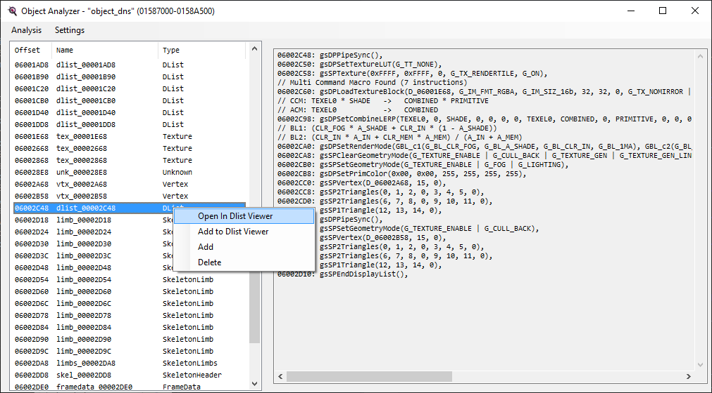
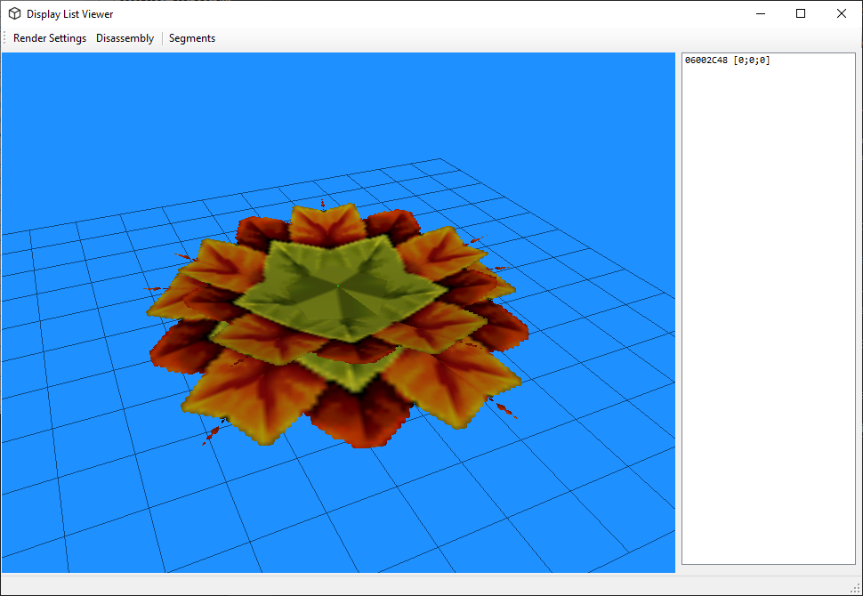
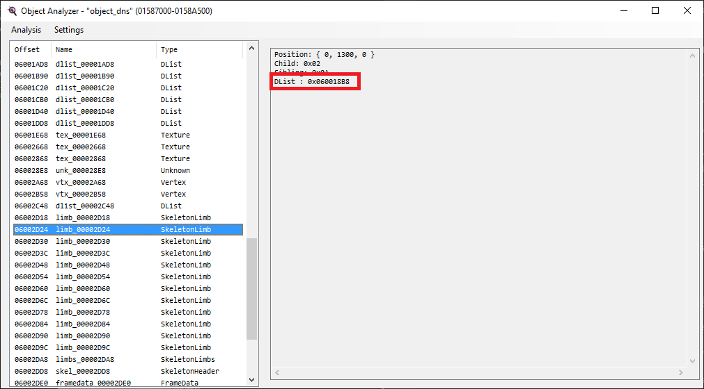

# Object Decompilation Example

- Previous: [Object Decompilation](object_decomp.md)

Let's take a look at `object_dns`, which is a pretty typical NPC object. It's used by one actor: `ovl_En_Dns`.

## Step 1: Naming the skeleton and limbs

We already went through the steps of opening an object file in Z64Utils in the [documenting step](documenting.md#z64utils), but we'll do it in more detail here. First, search for the object file, then right-click and select "Open in Object Analyzer". It will ask you to choose a segment: this is the segment that the file is put on, and allows Z64Utils to resolve the segmented addresses it references into symbols. The json already knows it should be segment 6, so just click OK.


In the resulting window, go to "Analysis -> Find Dlists" and press OK (the defaults are usually fine). This will only find display lists, so to find everything else in the obect, do "Analysis -> Analyze Dlists". We're looking for the skeleton, so scroll down to the SkeletonHeader, right-click it, and select "Open in Skeleton Viewer":


When you open the Skeleton Viewer, you'll see a list of animations off to the side. Selecting one of them will display an error that says something like `RENDER ERROR AT 0x06001A98! (Could not read 0x80 bytes at address 08000000)`. This is because one of the display lists in the skeleton is expecting something to be set at segment 8. From the actor, we know that it's expecting the eye textures to be loaded into segment 8 like so:
```c
static TexturePtr D_8092DE1C[] = { &D_060028E8, &D_06002968, &D_060029E8, &D_06002968 };
[...]
gSPSegment(POLY_OPA_DISP++, 0x08, Lib_SegmentedToVirtual(sEyeTextures[this->eyeIndex]));
```

Let's set segment 8 to be one of the eye textures listed here. Click on "Segments", then for segment 08, click "Edit" and select "Address" as the source. Input "060028E8" as the address, then hit OK. This should result in the window looking as follows:


Now that we've gotten around the error, we can see what each limb in the skeleton corresponds to by clicking on it in the Hierarchy. Clicking on any given limb will highlight what part of the model it represents in red. Note that some limbs don't actually render anything, so sometimes clicking on a limb will not turn anything red. In the below example, this limb is clearly the head:


We can now start naming the skeleton and individual limbs. Since we know this particular skeleton is the King's Chamber Deku Guard, we can name the skeleton `gKingsChamberDekuGuardSkel`. For the LimbNone name, we can call it something like `KINGS_CHAMBER_DEKU_GUARD_LIMB_NONE`, and we can name the LimbMax similarly. For the EnumName, we can name it `KingsChamberDekuGuardLimbs`. For each individual limb, we can name them based on what we see in Z64Utils; just make sure to update both the Name and the EnumName. After naming everything, we have something that looks like this:
```xml
<Limb Name="gKingsChamberDekuGuardTorsoLimb" Type="Standard" EnumName="KINGS_CHAMBER_DEKU_GUARD_LIMB_TORSO" Offset="0x2D18" />
<Limb Name="gKingsChamberDekuGuardHeadLimb" Type="Standard" EnumName="KINGS_CHAMBER_DEKU_GUARD_LIMB_HEAD" Offset="0x2D24" />
<Limb Name="gKingsChamberDekuGuardStalkLimb" Type="Standard" EnumName="KINGS_CHAMBER_DEKU_GUARD_LIMB_STALK" Offset="0x2D30" />
<Limb Name="gKingsChamberDekuGuardLeftLeafLimb" Type="Standard" EnumName="KINGS_CHAMBER_DEKU_GUARD_LIMB_LEFT_LEAF" Offset="0x2D3C" />
<Limb Name="gKingsChamberDekuGuardRightLeafLimb" Type="Standard" EnumName="KINGS_CHAMBER_DEKU_GUARD_LIMB_RIGHT_LEAF" Offset="0x2D48" />
<Limb Name="gKingsChamberDekuGuardCenterLeafLimb" Type="Standard" EnumName="KINGS_CHAMBER_DEKU_GUARD_LIMB_CENTER_LEAF" Offset="0x2D54" />
<Limb Name="gKingsChamberDekuGuardSnoutLimb" Type="Standard" EnumName="KINGS_CHAMBER_DEKU_GUARD_LIMB_SNOUT" Offset="0x2D60" />
<Limb Name="gKingsChamberDekuGuardRightMustacheLimb" Type="Standard" EnumName="KINGS_CHAMBER_DEKU_GUARD_LIMB_RIGHT_MUSTACHE" Offset="0x2D6C" />
<Limb Name="gKingsChamberDekuGuardLeftMustacheLimb" Type="Standard" EnumName="KINGS_CHAMBER_DEKU_GUARD_LIMB_LEFT_MUSTACHE" Offset="0x2D78" />
<Limb Name="gKingsChamberDekuGuardEyesLimb" Type="Standard" EnumName="KINGS_CHAMBER_DEKU_GUARD_LIMB_EYES" Offset="0x2D84" />
<Limb Name="gKingsChamberDekuGuardLeftFootLimb" Type="Standard" EnumName="KINGS_CHAMBER_DEKU_GUARD_LIMB_LEFT_FOOT" Offset="0x2D90" />
<Limb Name="gKingsChamberDekuGuardRightFootLimb" Type="Standard" EnumName="KINGS_CHAMBER_DEKU_GUARD_LIMB_RIGHT_FOOT" Offset="0x2D9C" />
<Skeleton Name="gKingsChamberDekuGuardSkel" Type="Normal" LimbType="Standard" LimbNone="KINGS_CHAMBER_DEKU_GUARD_LIMB_NONE" LimbMax="KINGS_CHAMBER_DEKU_GUARD_LIMB_MAX" EnumName="KingsChamberDekuGuardLimbs" Offset="0x2DD8" />
```

Now we can run `./extract_assets.py -s objects/object_dns` to extract the object again, this time with our new names. What can we do with this? Quite a bit actually. In `z_en_dns.h`, we can add this to the top of the file to start using these new names in our code:
```c
#include "objects/object_dns/object_dns.h"
```

Now, we can redefine the `jointTable` and `morphTable` in terms of the limb enum we defined before, like so:
```c
/* 0x22A */ Vec3s jointTable[KINGS_CHAMBER_DEKU_GUARD_LIMB_MAX];
/* 0x278 */ Vec3s morphTable[KINGS_CHAMBER_DEKU_GUARD_LIMB_MAX];
```

We can also use our new skeleton name and limb enum when initialization the skeleton like so:
```c
SkelAnime_Init(globalCtx, &this->skelAnime, &gKingsChamberDekuGuardSkel, NULL, this->jointTable, this->morphTable, KINGS_CHAMBER_DEKU_GUARD_LIMB_MAX);
```

Lastly, we can use our limb enum in `EnDns_PostLimbDraw`. Where the code originally had:
```c
if (limbIndex == 2) {
    [...]
}
```

We can instead write:
```c
if (limbIndex == KINGS_CHAMBER_DEKU_GUARD_LIMB_HEAD) {
    [...]
}
```

## Step 2: Naming the animations

Now that we have the skeleton figured out, it's time to name all the animations. In the Skeleton Viewer, you can hit the "play" button on any animation to see what it looks like. Note that some objects have multiple skeletons, and selecting an animation that is associated with a different skeleton than the one you're looking at can cause odd behavior. Try to give each animation a descriptive name based on what it looks like. If you're struggling;
- Try viewing the animation in game. In what contexts does this animation play?
- Try analyzing the code for the actor to see when the animation is used. Is this animation ever referenced?
- If you're still really struggling, Majora's Mask 3D contains the original animation names for the majority of animations in the game. These original names can help you figure out what the developers were originally intending. Explaining how to find these animations in MM3D is outside of the scope of this document, so just ask in Discord if you want to try this.

After naming the animations, the end result will look something like this:
```xml
<Animation Name="gKingsChamberDekuGuardDanceAnim" Offset="0x2A8" />
<Animation Name="gKingsChamberDekuGuardFlipAnim" Offset="0x734" />
<Animation Name="gKingsChamberDekuGuardSurpriseStartAnim" Offset="0x8F4" />
<Animation Name="gKingsChamberDekuGuardSurpriseLoopAnim" Offset="0xBD8" />
<Animation Name="gKingsChamberDekuGuardRunStartAnim" Offset="0xD58" />
<Animation Name="gKingsChamberDekuGuardRunLoopAnim" Offset="0xFEC" />
[...]
<Animation Name="gKingsChamberDekuGuardIdleAnim" Offset="0x3310" />
<Animation Name="gKingsChamberDekuGuardWalkAnim" Offset="0x34EC" />
```

Once again, we can run `./extract_assets.py -s objects/object_dns` to extract the object, and we can update the animation names in `z_en_dns.c` to use our new names like so:
```c
static ActorAnimationEntryS sAnimations[] = {
    { &gKingsChamberDekuGuardIdleAnim, 1.0f, 0, -1, 0, 0 },
    { &gKingsChamberDekuGuardIdleAnim, 1.0f, 0, -1, 0, -4 },
    { &gKingsChamberDekuGuardWalkAnim, 1.0f, 0, -1, 0, 0 },
    { &gKingsChamberDekuGuardWalkAnim, 1.0f, 0, -1, 0, -4 },
    { &gKingsChamberDekuGuardSurpriseStartAnim, 1.0f, 0, -1, 2, 0 },
    { &gKingsChamberDekuGuardSurpriseLoopAnim, 1.0f, 0, -1, 0, 0 },
    { &gKingsChamberDekuGuardRunStartAnim, 1.0f, 0, -1, 2, 0 },
    { &gKingsChamberDekuGuardRunLoopAnim, 1.0f, 0, -1, 0, 0 },
    { &gKingsChamberDekuGuardDanceAnim, 1.0f, 0, -1, 2, 0 },
    { &gKingsChamberDekuGuardFlipAnim, 1.0f, 0, -1, 2, 0 },
};
```

## Step 3: Identifying the blob

In the XML, you may notice undefined blobs like this:
```xml
<!-- <Blob Name="object_dns_Blob_0028E8" Size="0x180" Offset="0x28E8" /> -->
```

You might already have an idea as to what this is based on what you've seen before. Recall that the eye textures are referenced in the actor's code like this:
```c
static TexturePtr D_8092DE1C[] = { &D_060028E8, &D_06002968, &D_060029E8, &D_06002968 };
```

Do you notice how the "28E8" in `D_060028E8` also appears as the Offset in that blob? That's because the blob is just the eye textures; the process for automatically creating the XML wasn't able to figure it out on its own, so we'll need to do it ourselves. But how should we define these textures in the XML? Recall that the eye textures were loaded into segment 8; let's take a look in `object_dns.c` and see if we can find something that uses this segment. This display list has the answer:
```c
Gfx object_dns_DL_001A50[] = {
    [...]
    gsDPLoadTextureBlock(0x08000000, G_IM_FMT_RGBA, G_IM_SIZ_16b, 8, 8, 0, G_TX_NOMIRROR | G_TX_CLAMP, G_TX_NOMIRROR |
                         G_TX_CLAMP, 3, 3, G_TX_NOLOD, G_TX_NOLOD),
    [...]
};
```

Using `0x08000000` with `gsDPLoadTextureBlock` signals that this display list is expecting a texture in segment 8. What kind of texture is it expecting? We can look at the arguments after the `0x08000000`. It's looking for an RBGA16 texture with dimensions of 8x8, so we can define these textures in the XML like so:
```xml
<Texture Name="object_dns_Tex_0028E8" OutName="tex_0028E8" Format="rgba16" Width="8" Height="8" Offset="0x28E8" />
<Texture Name="object_dns_Tex_002968" OutName="tex_002968" Format="rgba16" Width="8" Height="8" Offset="0x2968" />
<Texture Name="object_dns_Tex_0029E8" OutName="tex_0029E8" Format="rgba16" Width="8" Height="8" Offset="0x29E8" />
```

Now, we just have to name them. In [Step #1](#step-1-naming-the-skeleton-and-limbs), we set segment 8 to one of the eye textures; we can use that same technique with the other two eye textures to see what they are. Like most NPCs, these various eye textures are used for handling blinking, so we can name them based on how open the eye is:
```xml
<Texture Name="gKingsChamberDekuGuardEyeOpenTex" OutName="kings_chamber_deku_guard_eye_open" Format="rgba16" Width="8" Height="8" Offset="0x28E8" />
<Texture Name="gKingsChamberDekuGuardEyeHalfTex" OutName="kings_chamber_deku_guard_eye_half" Format="rgba16" Width="8" Height="8" Offset="0x2968" />
<Texture Name="gKingsChamberDekuGuardEyeClosedTex" OutName="kings_chamber_deku_guard_eye_closed" Format="rgba16" Width="8" Height="8" Offset="0x29E8" />
```

Like with previous steps, we can run `./extract_assets.py -s objects/object_dns` and then update `z_en_dns.c` with our new names:
```c
static TexturePtr sEyeTextures[] = {
    gKingsChamberDekuGuardEyeOpenTex,
    gKingsChamberDekuGuardEyeHalfTex,
    gKingsChamberDekuGuardEyeClosedTex,
    gKingsChamberDekuGuardEyeHalfTex,
};
```

Note that this step might be tricky to do if multiple things in the actor use the same segment. It's okay to wait to do this until you've named all the display lists in the actor, since that will make it easier to find the display list associated with a given texture.

## Step #4: Naming anything else in the actor

For some actors, there may be a few other things left to name that are directly referenced in the actor's code. In our case, there is one display list that we still need to name:
```c
gSPDisplayList(POLY_OPA_DISP++, &D_06002C48);
```

In Z64Utils, scroll to find this display list, then right-click and select "Open in Dlist Viewer":



We can see this is the guard's Deku Flower:



We can name the display list as such in the XML:
```xml
<DList Name="gKingsChamberDekuGuardDekuFlower" Offset="0x2C48" />
```

Then, like all steps before, we can run `./extract_assets.py -s objects/object_dns` and then update `z_en_dns.c` with our new name:
```c
gSPDisplayList(POLY_OPA_DISP++, gKingsChamberDekuGuardDekuFlower);
```

Since we've now named every single thing in the actor, we can delete all symbols associated with `ovl_En_Dns` in [undefined_syms](../../undefined_syms.txt).

## Step #5: Naming limb display lists

Now that we've named everything that's used externally by the actor, we just need to clean up the rest of the unnamed stuff in the XML. Let's start by naming the display lists for each limb. There are two ways you can determine which display list is associated with a given limb. One way is to click on the limb in Z64Utils; it will tell you what display list is used for that limb:



Another way is to simply check `object_dns.c`. Each limb lists its own display list like this:
```c
StandardLimb gKingsChamberDekuGuardHeadLimb = { 
    { 0, 1300, 0 }, KINGS_CHAMBER_DEKU_GUARD_STALK_LIMB - 1, KINGS_CHAMBER_DEKU_GUARD_LEFT_FOOT_LIMB - 1,
    object_dns_DL_0018B8
};
```

Either way you go about it, you should be able to name all the limb display lists like so:
```xml
<DList Name="gKingsChamberDekuGuardRightFootDL" Offset="0x1640" />
<DList Name="gKingsChamberDekuGuardLeftFootDL" Offset="0x16F0" />
<DList Name="gKingsChamberDekuGuardSnoutDL" Offset="0x17A0" />
<DList Name="gKingsChamberDekuGuardHeadDL" Offset="0x18B8" />
<DList Name="gKingsChamberDekuGuardStalkDL" Offset="0x19B8" />
<DList Name="gKingsChamberDekuGuardEyesDL" Offset="0x1A50" />
<DList Name="gKingsChamberDekuGuardTorsoDL" Offset="0x1AD8" />
<DList Name="gKingsChamberDekuGuardLeftMustacheDL" Offset="0x1B90" />
<DList Name="gKingsChamberDekuGuardRightMustacheDL" Offset="0x1C20" />
<DList Name="gKingsChamberDekuGuardLeftLeafDL" Offset="0x1CB0" />
<DList Name="gKingsChamberDekuGuardCenterLeafDL" Offset="0x1D40" />
<DList Name="gKingsChamberDekuGuardRightLeafDL" Offset="0x1DD8" />
```

Run `./extract_assets.py -s objects/object_dns` once again, since it will help in the next step to have all of our display lists named.

### Step #6: Naming remaining textures

With every display list named, it's now a lot easier to name the remaining textures. In the `assets/objects/object_dns/` folder, you can see all the textures in the object as various PNG files. For some of the textures, just looking at them will give you a good idea as to what they should be named. For other textures, it may help to see how the texture is used in the object's display lists. Let's take a look at `object_dns_Tex_002868`, which is only used in one display list:
```c
Gfx gKingsChamberDekuGuardSnoutDL[] = {
    [...]
    gsDPLoadTextureBlock(object_dns_Tex_002868, G_IM_FMT_RGBA, G_IM_SIZ_16b, 8, 8, 0, G_TX_MIRROR | G_TX_CLAMP,
                         G_TX_MIRROR | G_TX_CLAMP, 3, 3, G_TX_NOLOD, G_TX_NOLOD),
    [...]
};
```

Since `tex_002868.rgba16.png` looks like the inside of the Deku Guard's mouth, and since it's *only* used in the snout display list, you can probably name this something like `gKingsChamberDekuGuardMouthTex`. But rather than guessing, we can confirm it by editing the texture ourselves and then viewing it in-game. Let's change `tex_002868.rgba16.png` to this:


Now, rebuild the game using [the steps described here](object_decomp.md#building-and-investigative-modding) and look at the guard in-game. You should see something like this:


This confirms our suspicion that this is indeed the mouth texture, so we can name it as such. We can use similar strategies to name all the other textures like so:
```xml
<Texture Name="gKingsChamberDekuGuardLeafTex" OutName="kings_chamber_deku_guard_leaf" Format="rgba16" Width="32" Height="32" Offset="0x1E68" />
<Texture Name="gKingsChamberDekuGuardBodyTex" OutName="kings_chamber_deku_guard_body" Format="rgba16" Width="16" Height="16" Offset="0x2668" />
<Texture Name="gKingsChamberDekuGuardMouthTex" OutName="kings_chamber_deku_guard_mouth" Format="rgba16" Width="8" Height="8" Offset="0x2868" />
```

### Step #7: Finishing up

If you have any other unnamed assets, now's the time to identify them. Otherwise, finish up the file by putting a comment at the top above the `<File>` node:
```xml
<Root>
    <!-- Assets for the King's Chamber Deku Guards -->
    <File Name="object_dns" Segment="6">
```

And we're done! Hopefully, you found this example helpful when decompiling your own objects.