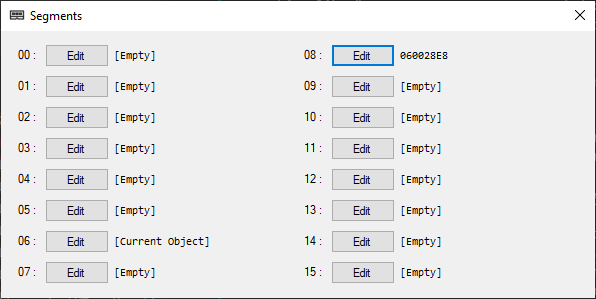

# Object Decompilation Example

Let's take a look at `object_dns`, which is a pretty typical NPC object. It's used by one actor: `ovl_En_Dns`.

## Step 1: Naming the skeleton and limbs

We already went through the steps of opening an object file in Z64Utils in the [documenting step](documenting.md#z64utils), but we'll do it one more time here. First, search for the object file, then right-click and select "Open in Object Analyzer". It will ask you to choose a segment: this is the segment that the file is put on, and allows Z64Utils to resolve the segmented addresses it references into symbols. The json already knows it should be segment 6, so just click OK.


In the resulting window, go to "Analysis -> Find Dlists" and press OK (the defaults are usually fine). This will only find display lists, so to find everything else in the obect, do "Analysis -> Analyze Dlists". We're looking for the skeleton, so scroll down to the SkeletonHeader, right-click it, and select "Open in Skeleton Viewer":


When you open the Skeleton Viewer, you'll see a list of animations off to the side. Selecting one of them will display an error that says something like "RENDER ERROR AT 0x06001A98! (Could not read 0x80 bytes at address 08000000)". This is because one of the display lists in the skeleton is expecting something to be set at segment 8. From the actor, we know that it's expecting the eye textures to be loaded into segment 8 like so:
```c
static TexturePtr sEyeTextures[] = { D_060028E8, D_06002968, D_060029E8, D_06002968 };
[...]
gSPSegment(POLY_OPA_DISP++, 0x08, Lib_SegmentedToVirtual(sEyeTextures[this->eyeIndex]));
```

Let's set segment 8 to be one of the eye textures listed here. Click on "Segments", then for segment 08, click "Edit" and select "Address" as the source. Input "060028E8" as the address, then hit OK. This should result in the window looking as follows:



Now that we've gotten around the error, we can see what each limb in the skeleton corresponds to by clicking on it in the Hierarchy. Clicking on any given limb will highlight what part of the model it represents in red. Note that some limbs don't actually render anything, so sometimes clicking on a limb will not turn anything red. In the below example, this limb is clearly the head:


We can now start naming the skeleton and individual limbs. Since we know this particular skeleton is the King's Chamber Deku Guard, we can name the skeleton `gKingsChamberDekuGuardSkel`. For the LimbNone name, we can call it something like `KINGS_CHAMBER_DEKU_GUARD_LIMB_NONE`, and we can name the LimbMax similarly. For the EnumName, we can name it `KingsChamberDekuGuardLimbs`. For each individual limb, we can name them based on what we see in Z64Utils; just make sure to update both the Name and the EnumName. After naming everything, we have something that looks like this:
```xml
<Limb Name="gKingsChamberDekuGuardTorsoLimb" Type="Standard" EnumName="KINGS_CHAMBER_DEKU_GUARD_TORSO_LIMB" Offset="0x2D18" />
<Limb Name="gKingsChamberDekuGuardHeadLimb" Type="Standard" EnumName="KINGS_CHAMBER_DEKU_GUARD_HEAD_LIMB" Offset="0x2D24" />
<Limb Name="gKingsChamberDekuGuardStalkLimb" Type="Standard" EnumName="KINGS_CHAMBER_DEKU_GUARD_STALK_LIMB" Offset="0x2D30" />
<Limb Name="gKingsChamberDekuGuardLeftLeafLimb" Type="Standard" EnumName="KINGS_CHAMBER_DEKU_GUARD_LEFT_LEAF_LIMB" Offset="0x2D3C" />
<Limb Name="gKingsChamberDekuGuardRightLeafLimb" Type="Standard" EnumName="KINGS_CHAMBER_DEKU_GUARD_RIGHT_LEAF_LIMB" Offset="0x2D48" />
<Limb Name="gKingsChamberDekuGuardCenterLeafLimb" Type="Standard" EnumName="KINGS_CHAMBER_DEKU_GUARD_CENTER_LEAF_LIMB" Offset="0x2D54" />
<Limb Name="gKingsChamberDekuGuardMouthLimb" Type="Standard" EnumName="KINGS_CHAMBER_DEKU_GUARD_MOUTH_LIMB" Offset="0x2D60" />
<Limb Name="gKingsChamberDekuGuardRightMustacheLimb" Type="Standard" EnumName="KINGS_CHAMBER_DEKU_GUARD_RIGHT_MUSTACHE_LIMB" Offset="0x2D6C" />
<Limb Name="gKingsChamberDekuGuardLeftMustacheLimb" Type="Standard" EnumName="KINGS_CHAMBER_DEKU_GUARD_LEFT_MUSTACHE_LIMB" Offset="0x2D78" />
<Limb Name="gKingsChamberDekuGuardEyesLimb" Type="Standard" EnumName="KINGS_CHAMBER_DEKU_GUARD_EYES_LIMB" Offset="0x2D84" />
<Limb Name="gKingsChamberDekuGuardLeftFootLimb" Type="Standard" EnumName="KINGS_CHAMBER_DEKU_GUARD_LEFT_FOOT_LIMB" Offset="0x2D90" />
<Limb Name="gKingsChamberDekuGuardRightFootLimb" Type="Standard" EnumName="KINGS_CHAMBER_DEKU_GUARD_RIGHT_FOOT_LIMB" Offset="0x2D9C" />
<Skeleton Name="gKingsChamberDekuGuardSkel" Type="Normal" LimbType="Standard" LimbNone="KINGS_CHAMBER_DEKU_GUARD_LIMB_NONE" LimbMax="KINGS_CHAMBER_DEKU_GUARD_LIMB_MAX" EnumName="KingsChamberDekuGuardLimbs" Offset="0x2DD8" />
```

Now we can run `./extract_assets.py -s objects/object_dns` to extract the object again, this time with our new names. What can we do with this? Quite a bit actually. In `z_en_dns.h`, we can add this to the top of the file to start using these new names in our code:
```c
#include "objects/object_dns/object_dns.h"
```

Now, we can redefine the `jointTable` and `morphTable` in terms of the limb enum we defined before, like so:
```c
/* 0x22A */ Vec3s jointTable[KINGS_CHAMBER_DEKU_GUARD_LIMB_MAX];
/* 0x278 */ Vec3s morphTable[KINGS_CHAMBER_DEKU_GUARD_LIMB_MAX];
```

We can also use our new skeleton name and limb enum when initialization the skeleton like so:
```c
SkelAnime_Init(globalCtx, &this->skelAnime, &gKingsChamberDekuGuardSkel, NULL, this->jointTable, this->morphTable, KINGS_CHAMBER_DEKU_GUARD_LIMB_MAX);
```

Lastly, we can use our limb enum in `EnDns_PostLimbDraw`. Where the code originally had:
```c
if (limbIndex == 2) {
    [...]
}
```

We can instead write:
```c
if (limbIndex == KINGS_CHAMBER_DEKU_GUARD_HEAD_LIMB) {
    [...]
}
```